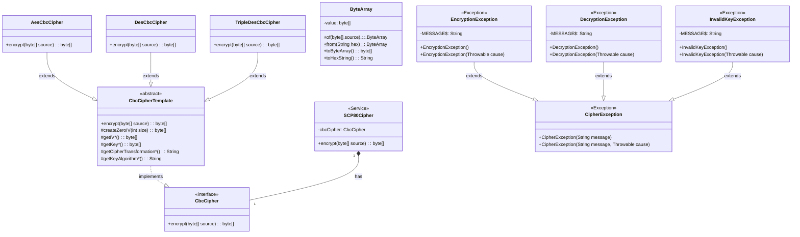

## Cipher
### 클래스 다이어그램

```mermaid
classDiagram
    %% 클래스 정의 (Class Definitions)
    %% class 클래스명 {
    %%   <<스테레오타입>>
    %%   +public멤버
    %%   -private멤버
    %%   #protected멤버
    %%   ~package멤버
    %%   +메서드(파라미터) 반환타입
    %%   +메서드$*()  --> $는 static, *는 abstract
    %% }
    
    class SCP80Cipher {
        <<Service>>
        -cbcCipher: CbcCipher
        +encrypt(byte[] source): byte[]
    }
    
    class CbcCipher {
        <<interface>>
        +encrypt(byte[] source): byte[]
    }
    
    class CbcCipherTemplate {
        <<abstract>>
        +encrypt(byte[] source): byte[]
        #createZeroIV(int size): byte[]
        #getIV*(): byte[]
        #getKey*(): byte[]
        #getCipherTransformation*(): String
        #getKeyAlgorithm*(): String
    }
    
    class AesCbcCipher {
        +encrypt(byte[] source): byte[]
    }
    
    class DesCbcCipher {
        +encrypt(byte[] source): byte[]
    }
    
    class TripleDesCbcCipher {
        +encrypt(byte[] source): byte[]
    }
    
    class ByteArray {
        -value: byte[]
        +of(byte[] source)$: ByteArray
        +from(String hex)$: ByteArray
        +toByteArray(): byte[]
        +toHexString(): String
    }

    class CipherException {
        <<Exception>>
        +CipherException(String message)
        +CipherException(String message, Throwable cause)
    }
    
    class EncryptionException {
        <<Exception>>
        -MESSAGE$: String
        +EncryptionException()
        +EncryptionException(Throwable cause)
    }
    
    class DecryptionException {
        <<Exception>>
        -MESSAGE$: String
        +DecryptionException()
        +DecryptionException(Throwable cause)
    }
    
    class InvalidKeyException {
        <<Exception>>
        -MESSAGE$: String
        +InvalidKeyException()
        +InvalidKeyException(Throwable cause)
    }

    %% 관계 정의 (Relationships)
    %% 클래스1 "다중성1" -- "다중성2" 클래스2 : 관계이름
    %% 구성(Composition): *--
    %% 집합(Aggregation): o--
    %% 연관(Association): -- 또는 -->
    %% 일반화/상속(Inheritance): <|--
    %% 실체화/구현(Realization): <|..

    CbcCipherTemplate ..|> CbcCipher : implements
    AesCbcCipher --|> CbcCipherTemplate : extends
    DesCbcCipher --|> CbcCipherTemplate : extends
    TripleDesCbcCipher --|> CbcCipherTemplate : extends
    SCP80Cipher "1" *-- "1" CbcCipher : has 
    
    EncryptionException --|> CipherException : extends
    DecryptionException --|> CipherException : extends
    InvalidKeyException --|> CipherException : extends
```
