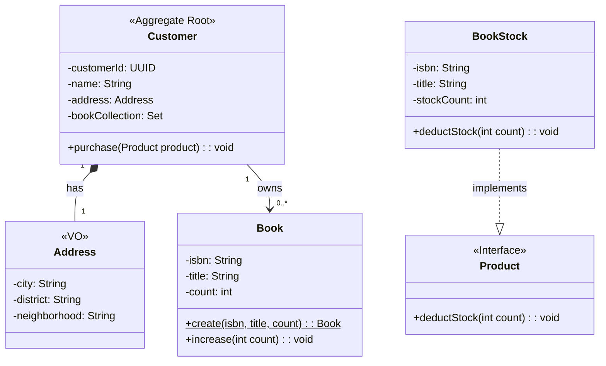

## 온라인 책 서점
### 클래스 다이어그램

```mermaid
classDiagram
    %% 클래스 정의 (Class Definitions)
    %% class 클래스명 {
    %%   <<스테레오타입>>
    %%   +public멤버
    %%   -private멤버
    %%   #protected멤버
    %%   ~package멤버
    %%   +메서드(파라미터) 반환타입
    %%   +메서드$*()  --> $는 static, *는 abstract
    %% }
    
    class Customer {
        <<Aggregate Root>>
        -customerId: UUID
        -name: String
        -address: Address
        -bookCollection: Set<Book>
        +purchase(Product product): void
    }

    class Address {
        <<VO>>
        -city: String
        -district: String
        -neighborhood: String
    }

    class Book {
        -isbn: String
        -title: String
        -count: int
        +create(isbn, title, count): Book$
        +increase(int count): void
    }

    class Product {
        <<Interface>>
        +deductStock(int count): void
    }

    class BookStock {
        -isbn: String
        -title: String
        -stockCount: int
        +deductStock(int count): void
    }

    %% 관계 정의 (Relationships)
    %% 클래스1 "다중성1" -- "다중성2" 클래스2 : 관계이름
    %% 구성(Composition): *--
    %% 집합(Aggregation): o--
    %% 연관(Association): -- 또는 -->
    %% 일반화/상속(Inheritance): <|--
    %% 실체화/구현(Realization): <|..

    Customer "1" *-- "1" Address : has
    Customer "1" --> "0..*" Book : owns
    BookStock ..|> Product : implements
```
