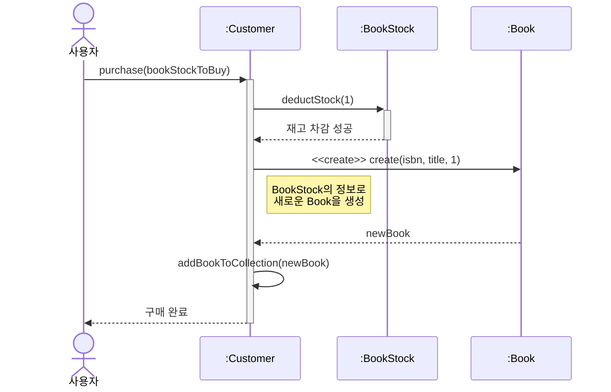

## 온라인 책 서점
### 시퀀스 다이어그램

```mermaid
sequenceDiagram
    actor 사용자
    participant C as :Customer
    participant BS as :BookStock
    participant B as :Book

    사용자->>+C: purchase(bookStockToBuy)
    C->>+BS: deductStock(1)
    BS-->>-C: 재고 차감 성공
    C->>B: <<create>> create(isbn, title, 1)
    Note right of C: BookStock의 정보로<br/>새로운 Book을 생성
    B-->>C: newBook
    C->>C: addBookToCollection(newBook)
    C-->>-사용자: 구매 완료
```
