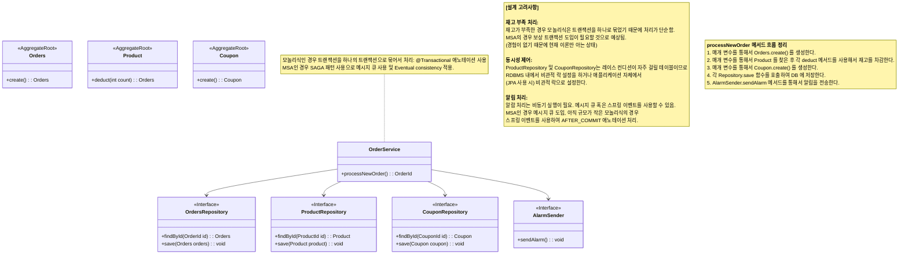

## 주문 도메인
### 클래스 다이어그램

```mermaid
classDiagram
%% -------------------
%% Classes & Interfaces
%% -------------------

class OrderService {
    +processNewOrder(): OrderId
}
note for OrderService "모놀리식인 경우 트랜잭션을 하나의 트랜잭션으로 묶어서 처리: @Transactional 애노테이션 사용<br>MSA인 경우 SAGA 패턴 사용으로 메시지 큐 사용 및 Eventual consistency 적용."

class OrdersRepository {
<<Interface>>
+findById(OrderId id): Orders
+save(Orders orders): void
}
class ProductRepository {
<<Interface>>
+findById(ProductId id): Product
+save(Product product): void
}
class CouponRepository {
<<Interface>>
+findById(CouponId id): Coupon
+save(Coupon coupon): void
}
class AlarmSender {
<<Interface>>
+sendAlarm(): void
}

class Orders {
<<AggregateRoot>>
+create(): Orders
}
class Product {
<<AggregateRoot>>
+deduct(int count): Orders
}
class Coupon {
<<AggregateRoot>>
+create(): Coupon
}

%% -------------------
%% Relationships
%% -------------------

OrderService --> OrdersRepository
OrderService --> ProductRepository
OrderService --> CouponRepository
OrderService --> AlarmSender

%% -------------------
%% Notes
%% -------------------

note for Dependencies "<b>[설계 고려사항]</b><br><br><b>재고 부족 처리:</b><br>재고가 부족한 경우 모놀리식은 트랜잭션을 하나로 묶었기 때문에 처리가 단순함.<br>MSA의 경우 보상 트랜잭션 도입이 필요할 것으로 예상됨.<br>(경험이 없기 때문에 현재 이론만 아는 상태)<br><br><b>동시성 제어:</b><br>ProductRepository 및 CouponRepository는 레이스 컨디션이 자주 걸릴 테이블이므로<br>RDBMS 내에서 비관적 락 설정을 하거나 애플리케이션 자체에서<br>(JPA 사용 시) 비관적 락으로 설정한다.<br><br><b>알림 처리:</b><br>알람 처리는 비동기 실행이 필요. 메시지 큐 혹은 스프링 이벤트를 사용할 수 있음.<br>MSA인 경우 메시지 큐 도입, 아직 규모가 작은 모놀리식의 경우<br>스프링 이벤트를 사용하여 AFTER_COMMIT 애노테이션 처리."

note for AggregateRoots "<b>processNewOrder 메서드 흐름 정리</b><br>1. 매개 변수를 통해서 Orders.create() 를 생성한다.<br>2. 매개 변수를 통해서 Product 를 찾은 후 각 deduct 메서드를 사용해서 재고를 차감한다.<br>3. 매개 변수를 통해서 Coupon.create() 를 생성한다.<br>4. 각 Repository.save 함수를 호출하여 DB 에 저장한다.<br>5. AlarmSender.sendAlarm 메서드를 통해서 알림을 전송한다."
```
